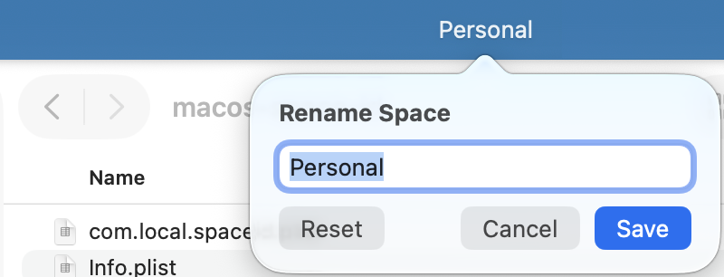
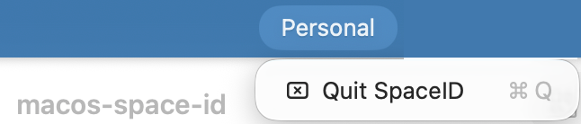

# macos-space-id

A macOS menu bar app that lets you assign names to Spaces (virtual desktops). The current space's name is always visible in the menu bar.

- **Left-click** the menu bar item to rename the current space
- **Right-click** for a Quit option

| | |
|---|---|
|  |  |

## Note on private APIs

Space enumeration relies on `CGSCopyManagedDisplaySpaces` and `CGSMainConnectionID`, which are private symbols exported by `CoreGraphics.framework`. They are not part of Apple's public SDK, carry no compatibility guarantee, and may break in a future macOS release. This app is intended for local use only and cannot be distributed via the App Store.

## Requirements

- macOS 13 Ventura or later
- Xcode Command Line Tools (`xcode-select --install`)

## Build & Run

```sh
make run
```

## Install (with auto-start at login)

```sh
make launchagent-install
```

To remove the auto-start:

```sh
make launchagent-uninstall
```
